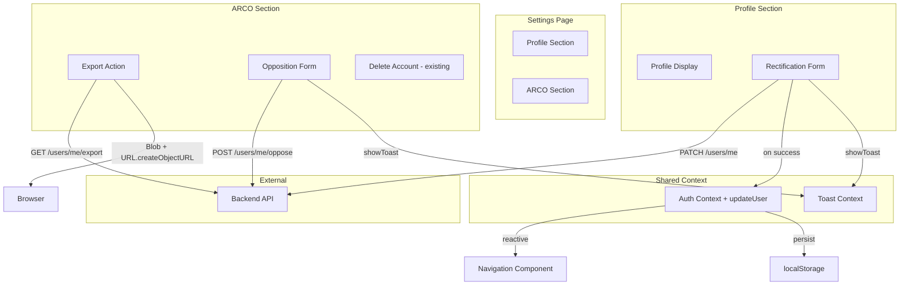

# Design Document: ARCO Profile Panel

## Overview

This feature completes the ARCO rights panel on the `/settings` page by adding a profile editing section (rectification), a working JSON export download (access), and an opposition form — all backed by existing API endpoints. The implementation is frontend-only: refactoring the existing Settings page into clearly separated Profile and ARCO sections while adding the `updateUser` method to the Auth Context for cross-app synchronization.

The page follows the "sala de lectura" design system and is built mobile-first, accessible, and consistent with the existing component patterns in the codebase.

## Architecture



### Key Architectural Decisions

1. **No new backend work**: All endpoints exist and are tested. The design only touches frontend.
2. **Auth Context enhancement**: Adding `updateUser(partial: Partial<UserInfo>)` to the existing `AuthContextValue` interface. This updates both in-memory state and localStorage without touching tokens.
3. **Inline validation**: Client-side validation runs on field blur and before submission using pure validation functions (extractable and testable independently).
4. **Export via Blob**: The JSON response is serialized to a Blob, a temporary object URL is created, and a programmatic `<a>` click triggers the download. The URL is revoked immediately after.
5. **Page structure**: The existing page is refactored into two card sections (Profile top, ARCO below) rather than being replaced, preserving delete account behavior.

## Components and Interfaces

### Auth Context Extension

```typescript
// Added to AuthContextValue interface
interface AuthContextValue extends AuthState {
  login(email: string, password: string): Promise<void>;
  register(data: RegisterRequest): Promise<void>;
  logout(): void;
  updateUser(fields: Partial<Pick<UserInfo, "name" | "email">>): void; // NEW
}
```

The `updateUser` function:
- Merges provided fields into the current `user` state
- Persists the updated `UserInfo` to localStorage via `storeUserInfo`
- Does NOT modify tokens (access_token, refresh_token remain untouched)
- Is synchronous — no API call, just state + localStorage update

### Validation Utilities

```typescript
// Pure functions — separately testable
export function validateName(name: string): string | null;
export function validateEmail(email: string): string | null;
export function validatePurpose(purpose: string): string | null;
export function isRectificationFormValid(name: string, email: string): boolean;
export function isOppositionFormValid(purpose: string): boolean;
```

**Validation rules:**
- `name`: non-empty after trim, 1–200 characters → returns null (valid) or error string
- `email`: non-empty, matches `/^[^\s@]+@[^\s@]+\.[^\s@]+$/`, max 320 chars → returns null or error string
- `purpose`: non-empty after trim, 1–200 characters → returns null or error string

### Export Download Utility

```typescript
export function triggerJsonDownload(data: unknown, filename: string): void;
export function generateExportFilename(): string;
```

- `generateExportFilename()`: returns `entrelineas-datos-YYYY-MM-DD.json` using current date
- `triggerJsonDownload(data, filename)`: creates a Blob from `JSON.stringify(data, null, 2)`, generates an object URL, creates a temporary `<a download>` element, clicks it, then revokes the URL

### Page Components

| Component | Responsibility |
|-----------|---------------|
| `SettingsPage` | Page layout, sections container |
| `ProfileSection` | Display mode + edit toggle + RectificationForm |
| `RectificationForm` | Inline form for name/email editing |
| `ArcoSection` | Groups 4 ARCO rights with legal info |
| `ExportAction` | Export button + download trigger + error/retry |
| `OppositionForm` | Purpose selection/input + submit |
| `DeleteAccount` | Existing delete flow (unchanged) |

These can be implemented as sub-components within the settings page file or extracted — the key constraint is that they remain within `frontend/src/app/settings/` or `frontend/src/components/settings/`.

### Predefined Opposition Purposes

```typescript
const OPPOSITION_PURPOSES = [
  "Recomendaciones de lectura",
  "Estadísticas de uso",
  "Comunicaciones no esenciales",
] as const;
```

The form presents these as clickable chips/buttons that populate the text input, while still allowing free text entry.

## Data Models

### Request/Response Types (frontend mirrors of backend schemas)

```typescript
// Already exists partially in types/index.ts — extend as needed

interface RectifyRequest {
  name?: string;
  email?: string;
}

interface RectifyResponse {
  user_id: string;
  name: string;
  email: string;
}

interface OpposeRequest {
  purpose: string;
}

interface OpposeResponse {
  user_id: string;
  processing_purpose: string;
  opposed: boolean;
}

// ExportData already exists in types/index.ts
```

### Component State Models

```typescript
// Profile Section
interface ProfileState {
  isEditing: boolean;
  name: string;
  email: string;
  nameError: string | null;
  emailError: string | null;
  isSubmitting: boolean;
  serverError: string | null;
}

// Export
interface ExportState {
  isExporting: boolean;
  error: string | null;
}

// Opposition
interface OppositionState {
  isOpen: boolean;
  purpose: string;
  purposeError: string | null;
  isSubmitting: boolean;
  serverError: string | null;
  showConfirmation: boolean;
}
```

## Correctness Properties

*A property is a characteristic or behavior that should hold true across all valid executions of a system — essentially, a formal statement about what the system should do. Properties serve as the bridge between human-readable specifications and machine-verifiable correctness guarantees.*

### Property 1: Rectification form validation correctly classifies inputs

*For any* string `name` and string `email`, the rectification form validation function returns valid if and only if: `name.trim().length` is between 1 and 200 (inclusive) AND `email` matches the basic email pattern (`/^[^\s@]+@[^\s@]+\.[^\s@]+$/`) with length ≤ 320.

**Validates: Requirements 1.3, 1.8**

### Property 2: Auth state synchronization after rectification

*For any* valid `RectifyResponse` containing a `name` and `email`, calling `updateUser({ name, email })` results in both `AuthContext.user` and `localStorage(USER_INFO_KEY)` containing the exact same name and email values, while preserving the existing `user.id`.

**Validates: Requirements 1.4, 6.1**

### Property 3: Token preservation after profile update

*For any* call to `updateUser(fields)`, the access token and refresh token stored in the browser remain identical to their values before the call. The function never reads, modifies, or clears token storage.

**Validates: Requirements 6.3**

### Property 4: Export file generation round-trip

*For any* valid `ExportData` object, serializing it via `triggerJsonDownload` produces a Blob whose content, when parsed back as JSON, is deeply equal to the original object. Additionally, the generated filename matches the pattern `entrelineas-datos-YYYY-MM-DD.json`.

**Validates: Requirements 2.2**

### Property 5: Opposition form validation correctly classifies inputs

*For any* string `purpose`, the opposition form validation function returns valid if and only if `purpose.trim().length` is between 1 and 200 (inclusive).

**Validates: Requirements 3.3, 3.7**

## Error Handling

### Rectification Errors

| Backend Status | `detail` value | UI Behavior |
|---|---|---|
| 409 | `"email_already_taken"` | Inline error on email field: "Este correo ya está en uso" |
| 400 | `"invalid_email_format"` | Inline error on email field: "Formato de correo inválido" |
| 400 | `"no_fields_provided"` | Inline error: "Debes modificar al menos un campo" |
| Network error | — | Toast error via `useToast` |
| 5xx | — | Toast error (handled by api-client globally) |

### Export Errors

| Condition | UI Behavior |
|---|---|
| Network/server failure | Inline error below export button + "Reintentar" button |
| Blob creation failure | Toast error (unlikely but defensive) |

### Opposition Errors

| Backend Status | UI Behavior |
|---|---|
| 400 (validation) | Inline error on purpose field |
| Network/5xx | Inline error below form |

### General Patterns

- All API errors caught via try/catch around `apiPatch`/`apiGet`/`apiPost`
- `ApiError` instances checked by `status` to map to specific inline messages
- Unknown errors display a generic "Ocurrió un error. Intenta de nuevo."
- Loading states prevent double-submission (button disabled + spinner text)

## Testing Strategy

### Unit Tests (Vitest + React Testing Library)

1. **Validation functions** — test `validateName`, `validateEmail`, `validatePurpose` with known edge cases (empty, whitespace-only, boundary lengths, special characters, valid inputs)
2. **Export filename generation** — verify ISO date format in filename
3. **Auth Context `updateUser`** — verify state and localStorage updates in isolation
4. **Component rendering** — verify correct sections render, ARIA attributes present, edit toggle works

### Property-Based Tests (fast-check + Vitest)

Property-based testing is appropriate here because the validation functions are pure functions with large input spaces (all possible strings) where universal properties hold.

**Library:** [fast-check](https://github.com/dubzzz/fast-check) (already the standard PBT library for TypeScript/Vitest ecosystems)

**Configuration:** Each property test runs a minimum of 100 iterations.

**Tests to implement:**

1. **Feature: arco-profile-panel, Property 1: Rectification form validation correctly classifies inputs**
   - Generate arbitrary strings for name and email
   - Assert: validation result matches the specification predicate

2. **Feature: arco-profile-panel, Property 2: Auth state synchronization after rectification**
   - Generate arbitrary valid name/email pairs
   - Assert: after `updateUser`, both context state and localStorage contain those exact values

3. **Feature: arco-profile-panel, Property 3: Token preservation after profile update**
   - Generate arbitrary valid name/email pairs and pre-set arbitrary token values
   - Assert: after `updateUser`, token storage is unchanged

4. **Feature: arco-profile-panel, Property 4: Export file generation round-trip**
   - Generate arbitrary JSON-serializable objects matching ExportData shape
   - Assert: `JSON.parse(blob.text())` equals original, filename matches pattern

5. **Feature: arco-profile-panel, Property 5: Opposition form validation correctly classifies inputs**
   - Generate arbitrary strings for purpose
   - Assert: validation result matches the specification predicate

### Integration Tests

- Full page render with mocked API calls verifying happy paths end-to-end
- Delete account still works after refactoring (regression)
- Navigation updates after rectification (context propagation)

### What is NOT property-tested

- UI rendering/layout (use snapshot tests if needed)
- Error message display (example-based)
- Loading states (example-based)
- Keyboard navigation (manual + example-based)
- Responsive design (manual + viewport testing)
