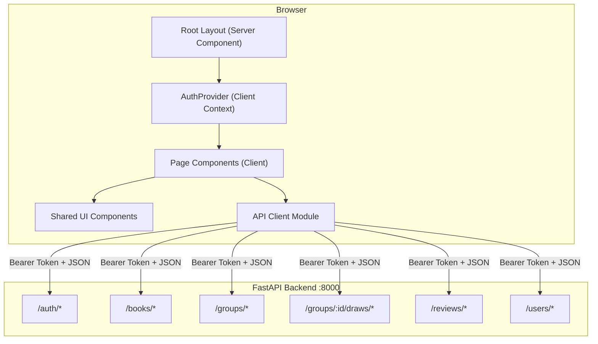

# Design Document: Frontend Catchup (M6.5)

## Overview

This design delivers a complete Next.js 16 frontend for EntreLíneas covering all backend functionality from milestones M0–M6. The application is built with React 19 (using the App Router), TypeScript, and Tailwind CSS, communicating with the FastAPI backend (port 8000) via a centralized API client.

The architecture follows a layered approach:
1. **API Client Layer** — Centralized HTTP module with automatic token attachment, refresh-on-401, and error propagation.
2. **Auth Context Layer** — React Context providing authentication state, login/logout actions, and token persistence.
3. **Page Layer** — Next.js App Router pages organized by feature domain.
4. **Component Layer** — Reusable UI components (forms, cards, toasts, navigation, skeletons).

Key design decisions:
- **No external state library**: React Context + `useState`/`useReducer` is sufficient for this scope. The app is session-scoped and each page fetches its own data.
- **Tokens stored in `localStorage`**: Simple, works across refreshes, acceptable for MVP phase. The API client reads tokens from there.
- **Client Components for interactivity**: Pages that call the API or manage form state are marked `"use client"`. Layout and navigation shells can be Server Components where no client interaction is needed.
- **Privacy-by-default in UI**: Review visibility never defaults to "shared". All sharing is explicit. No public routes expose user content.
- **No new dependencies beyond approved stack**: Next.js, React, TypeScript, Tailwind CSS. No Redux, no Zustand, no axios — plain `fetch` with a typed wrapper.

## Architecture



### Route Structure

| Route | Component | Auth Required | Description |
|-------|-----------|---------------|-------------|
| `/login` | LoginPage | No | Email + password login |
| `/register` | RegisterPage | No | Registration with consent |
| `/dashboard` | DashboardPage | Yes | Landing page with summary |
| `/library` | LibraryPage | Yes | Book list, search, add |
| `/groups` | GroupsPage | Yes | Family groups + invitations |
| `/selection` | SelectionPage | Yes | Reading draws per group |
| `/clubs` | ClubsListPage | Yes | Club list |
| `/clubs/[id]` | ClubDetailPage | Yes | Active book, comments, members |
| `/reviews` | ReviewsPage | Yes | User's reviews list |
| `/settings` | SettingsPage | Yes | Export data, delete account |

### Protected Route Strategy

A `ProtectedRoute` wrapper component checks `AuthContext`. If no valid token exists, it redirects to `/login?redirect={currentPath}`. After successful login, the user is navigated to the stored redirect path. This preserves the user's intended destination across the auth flow.

### File Organization

```
src/
├── app/
│   ├── layout.tsx              # Root layout (html, body, providers)
│   ├── page.tsx                # Redirect to /dashboard or /login
│   ├── login/page.tsx
│   ├── register/page.tsx
│   ├── dashboard/page.tsx
│   ├── library/page.tsx
│   ├── groups/page.tsx
│   ├── selection/page.tsx
│   ├── clubs/
│   │   ├── page.tsx
│   │   └── [id]/page.tsx
│   ├── reviews/page.tsx
│   └── settings/page.tsx
├── components/
│   ├── navigation.tsx
│   ├── protected-route.tsx
│   ├── toast.tsx
│   ├── skeleton.tsx
│   ├── confirm-dialog.tsx
│   ├── input-field.tsx
│   ├── select-field.tsx
│   └── star-rating.tsx
├── context/
│   ├── auth-context.tsx
│   └── toast-context.tsx
├── lib/
│   ├── api-client.ts
│   └── token-storage.ts
└── types/
    └── index.ts
```

## Components and Interfaces

### API Client (`src/lib/api-client.ts`)

```typescript
interface ApiClientConfig {
  baseUrl: string; // NEXT_PUBLIC_API_URL or "http://localhost:8000"
}

// Core methods
function apiGet<T>(path: string): Promise<T>;
function apiPost<T>(path: string, body?: unknown): Promise<T>;
function apiPatch<T>(path: string, body?: unknown): Promise<T>;
function apiDelete(path: string): Promise<void>;
function apiPostForm<T>(path: string, formData: FormData): Promise<T>;
```

**Behavior:**
- Reads `access_token` from `localStorage` and attaches as `Authorization: Bearer <token>`.
- On HTTP 401: calls `POST /auth/refresh` with stored `refresh_token`. On success, stores new tokens and retries original request exactly once. On failure, clears all tokens and redirects to `/login`.
- On HTTP 4xx (non-401): throws an `ApiError` containing the parsed response body (for field-level errors in forms).
- On HTTP 5xx: triggers toast notification with generic error message ("Error de servidor. Intenta de nuevo más tarde.").
- Base URL configurable via `NEXT_PUBLIC_API_URL` environment variable.

### Token Storage (`src/lib/token-storage.ts`)

```typescript
function getAccessToken(): string | null;
function getRefreshToken(): string | null;
function setTokens(access: string, refresh: string): void;
function clearTokens(): void;
function decodeTokenPayload(token: string): { sub: string; exp: number } | null;
```

Thin wrapper around `localStorage` for token CRUD. The `decodeTokenPayload` function base64-decodes the JWT payload (no verification needed client-side — the backend verifies).

### Auth Context (`src/context/auth-context.tsx`)

```typescript
interface AuthState {
  isAuthenticated: boolean;
  user: { id: string; name: string; email: string } | null;
  isLoading: boolean; // true while checking stored tokens on mount
}

interface AuthContextValue extends AuthState {
  login(email: string, password: string): Promise<void>;
  register(data: RegisterFormData): Promise<void>;
  logout(): void;
}
```

**Token Lifecycle:**
- On mount: check `localStorage` for tokens. If present and not expired, set `isAuthenticated = true` and decode user info from token payload.
- On `login()`: call `POST /auth/login`, store tokens, set authenticated state.
- On `register()`: call `POST /auth/register`. Does not auto-login (user redirected to login page after successful registration).
- On `logout()`: call `POST /auth/logout` with refresh token, clear `localStorage`, set `isAuthenticated = false`, redirect to `/login`.

### Toast System (`src/context/toast-context.tsx`)

```typescript
interface Toast {
  id: string;
  message: string;
  type: "success" | "error" | "info";
}

interface ToastContextValue {
  showToast(message: string, type: Toast["type"]): void;
}
```

Provider wraps the app. Toasts auto-dismiss after 4 seconds. Stacked in bottom-right (desktop) or bottom-center (mobile).

### Navigation Component (`src/components/navigation.tsx`)

- **Desktop (≥768px)**: Fixed left sidebar (w-64) with icon + text links to each section. User name at bottom with logout action.
- **Mobile (<768px)**: Fixed bottom bar with 5 icon tabs (Dashboard, Library, Clubs, Reviews, Settings). Groups and Selection accessible from Dashboard.
- Active section highlighted via `usePathname()`.

### Shared Form Components

| Component | Props | Purpose |
|-----------|-------|---------|
| `InputField` | `label, name, type, error?, placeholder?` | Text/email/password input with error display |
| `SelectField` | `label, name, options, error?` | Dropdown with error display |
| `StarRating` | `value, onChange, readonly?` | Interactive 1–5 star picker |
| `ConfirmDialog` | `title, message, confirmText, onConfirm, onCancel` | Modal for destructive actions |
| `Skeleton` | `variant: "card" | "list" | "text"` | Loading placeholders |

## Data Models

### TypeScript Types (`src/types/index.ts`)

```typescript
// === Auth ===
interface LoginResponse {
  access_token: string;
  refresh_token: string;
  token_type: string;
}

interface RegisterRequest {
  name: string;
  email: string;
  password: string;
  consent_policy_version: string;
  consent_purpose: string;
}

interface UserInfo {
  id: string;
  name: string;
  email: string;
}

// === Library ===
interface Book {
  id: string;
  title: string;
  author: string;
  genres: string[];
  description: string | null;
  pages: number | null;
  isbn: string | null;
  created_at: string;
}

interface CreateBookRequest {
  title: string;
  author: string;
  genres?: string[];
  description?: string;
  pages?: number;
  isbn?: string;
}

interface Copy {
  id: string;
  book_id: string;
  user_id: string;
  format: "physical" | "digital";
  filename: string | null;
  created_at: string;
}

// === Groups ===
interface FamilyGroup {
  id: string;
  name: string;
  created_at: string;
}

interface GroupMembership {
  id: string;
  group_id: string;
  user_id: string;
  status: "pending" | "accepted";
  created_at: string;
}

// === Reading Selection ===
interface Draw {
  id: string;
  group_id: string;
  filters: Record<string, unknown>;
  participants: string[];
  result_book_id: string | null;
  result_source_user_id: string | null;
  timestamp: string;
}

interface NextPicker {
  next_picker_user_id: string | null;
}

interface RunDrawRequest {
  participant_ids: string[];
  genre?: string;
  max_pages?: number;
  unread_only?: boolean;
}

// === Reviews ===
interface Review {
  id: string;
  user_id: string;
  book_id: string;
  rating: number; // 1–5
  text: string | null;
  visibility: "private" | "shared";
  shared_with_type: "group" | "club" | null;
  shared_with_id: string | null;
  created_at: string;
  updated_at: string;
}

interface CreateReviewRequest {
  book_id: string;
  rating: number;
  text?: string;
  visibility: "private" | "shared";
  shared_with_type?: "group" | "club";
  shared_with_id?: string;
}

// === Settings / Privacy ===
interface ExportData {
  user: { name: string; email: string; created_at: string };
  consents: Array<{
    id: string;
    timestamp: string;
    policy_version: string;
    purpose: string;
  }>;
  memberships: Array<{
    id: string;
    group_id: string;
    status: string;
    created_at: string;
  }>;
  processing_records: Array<{
    id: string;
    data_type: string;
    purpose: string;
    legal_basis: string;
    collected_at: string;
    retention_expires_at: string;
  }>;
}

// === API Error ===
interface ApiError {
  status: number;
  detail: string | Record<string, string>;
}
```

## Correctness Properties

*A property is a characteristic or behavior that should hold true across all valid executions of a system — essentially, a formal statement about what the system should do. Properties serve as the bridge between human-readable specifications and machine-verifiable correctness guarantees.*

### Property 1: Bearer token attachment

*For any* HTTP request made through the API client when an access token exists in storage, the request SHALL include an `Authorization` header with value `Bearer {token}`.

**Validates: Requirements 10.1**

### Property 2: Token refresh and retry on 401

*For any* HTTP request (any method, any path, any body) that receives a 401 response, the API client SHALL call `POST /auth/refresh` with the stored refresh token and retry the original request exactly once with the new access token.

**Validates: Requirements 1.8, 10.2**

### Property 3: Failed refresh triggers logout

*For any* HTTP request where both the original request and the refresh attempt return 401 (or the refresh call fails), the API client SHALL clear all stored tokens and trigger a redirect to `/login`.

**Validates: Requirements 1.9, 10.3**

### Property 4: Client error propagation

*For any* HTTP response with status code in 400–499 (excluding 401), the API client SHALL propagate the parsed JSON response body to the caller without transformation, enabling field-level error display.

**Validates: Requirements 1.6, 10.4**

### Property 5: Server error toast

*For any* HTTP response with status code in 500–599, the API client SHALL trigger a Toast notification with a generic server error message, regardless of the response body content.

**Validates: Requirements 10.5**

### Property 6: Protected route redirect with destination preservation

*For any* route path that is not `/login` or `/register`, when the user is unauthenticated, the app SHALL redirect to `/login?redirect={originalPath}` preserving the intended destination.

**Validates: Requirements 2.1, 2.2**

### Property 7: Post-login redirect consumption

*For any* valid path stored in the `redirect` query parameter at `/login`, upon successful authentication the app SHALL navigate the user to that stored path instead of the default dashboard.

**Validates: Requirements 2.3**

### Property 8: Review visibility never defaults to shared

*For any* initial render of the review creation form (regardless of context — from book detail or from /reviews), the visibility field SHALL NOT be pre-selected to "shared".

**Validates: Requirements 8.4**

### Property 9: Shared review requires explicit target

*For any* review form submission where visibility is set to "shared", the form SHALL reject submission unless exactly one sharing target (a specific Group or Club) has been selected.

**Validates: Requirements 8.3**

### Property 10: Account deletion requires exact email confirmation

*For any* string typed into the deletion confirmation input that does not exactly match the current user's email address, the "Delete Account" action SHALL remain disabled and unsubmittable.

**Validates: Requirements 9.4**

## Error Handling

### API Client Error Strategy

| HTTP Status | Behavior | User Feedback |
|-------------|----------|---------------|
| 401 | Attempt token refresh → retry once. If refresh fails → logout + redirect to `/login`. | Silent (automatic). If logout triggered: redirect only. |
| 400, 403, 404, 409, 422 | Propagate error body to calling component. | Component displays field-level or contextual error messages. |
| 500–599 | Catch and trigger toast. | Generic toast: "Error de servidor. Intenta de nuevo más tarde." |
| Network error | Catch fetch exception. | Toast: "No se pudo conectar al servidor." |

### Form Validation Errors

- Client-side validation runs before submission (required fields, email format, password match, consent check).
- Server-side errors from API (e.g., `email_already_exists`, `invalid_credentials`) are mapped to user-friendly Spanish messages.
- Field-level errors appear below the corresponding input in red text.
- Form-level errors (e.g., generic 400) appear as a banner above the form.

### Error Message Mapping

```typescript
const ERROR_MESSAGES: Record<string, string> = {
  invalid_credentials: "Email o contraseña incorrectos.",
  email_already_exists: "Este email ya está registrado.",
  consent_required: "Debes aceptar la política de privacidad.",
  group_not_found: "Grupo no encontrado.",
  not_group_member: "No eres miembro de este grupo.",
  already_member: "El usuario ya es miembro del grupo.",
  review_not_found: "Reseña no encontrada.",
  forbidden: "No tienes permiso para esta acción.",
  invalid_visibility_target: "Debes seleccionar con quién compartir la reseña.",
};
```

### Loading States

- Every page that fetches data shows a Skeleton component during loading.
- Form submit buttons show a spinner/disabled state during API calls to prevent double-submission.
- Navigation does not block — pages can render in parallel with data fetching.

### Token Expiry Edge Cases

- If `localStorage` contains tokens but the access token JWT `exp` is in the past, the app still sets `isAuthenticated = true` and lets the first API call trigger a refresh. This avoids clock-skew issues.
- If `localStorage` is cleared externally (by another tab or user action), the next API call will fail with 401, trigger refresh failure, and force logout.

## Testing Strategy

### Testing Framework

- **Vitest** for unit and property-based tests (fast, TypeScript-native, compatible with Next.js).
- **React Testing Library** for component rendering tests.
- **fast-check** for property-based testing (generates random inputs for universal property verification).
- **MSW (Mock Service Worker)** for mocking API responses in tests.

### Test Categories

#### Property-Based Tests (fast-check)

Each correctness property (Properties 1–10) is implemented as a property-based test with minimum 100 iterations. These focus on the API client module and form validation logic.

Configuration:
- Library: `fast-check`
- Minimum runs: 100 per property
- Tag format: `Feature: frontend-catchup, Property {N}: {title}`

Target modules for PBT:
- `src/lib/api-client.ts` — Properties 1–5
- `src/components/protected-route.tsx` — Properties 6–7
- `src/app/reviews/` form logic — Properties 8–9
- `src/app/settings/` confirmation logic — Property 10

#### Unit Tests (Vitest + React Testing Library)

- Component rendering tests (page structure, form fields, navigation links).
- User interaction flows (login, logout, form submission, toast display).
- Edge cases (empty states, error displays, loading skeletons).
- Mock API responses via MSW for integration-style component tests.

#### Example-Based Tests

Cover acceptance criteria classified as EXAMPLE:
- Login page renders with correct fields (1.1)
- Successful login stores tokens and redirects (1.2)
- Invalid login shows generic error (1.3)
- Registration page has required fields (1.4)
- Consent required before submission (1.5)
- Logout clears state and redirects (1.7)
- Dashboard renders summary and navigation (3.1–3.4)
- Library CRUD flows (4.2–4.6)
- Groups management flows (5.1–5.7)
- Selection page flows (6.1–6.5)
- Clubs page flows (7.1–7.8)
- Reviews creation and editing (8.1, 8.2, 8.5, 8.7)
- Settings export and deletion flows (9.1–9.3, 9.5, 9.6)

#### Edge Case Tests

- Empty library state (4.7)
- No books match draw filters (6.6)
- Network failure scenarios

### Test File Organization

```
src/
├── __tests__/
│   ├── lib/
│   │   ├── api-client.test.ts          # Properties 1–5 (PBT)
│   │   └── api-client.unit.test.ts     # Example-based unit tests
│   ├── components/
│   │   ├── protected-route.test.tsx    # Properties 6–7 (PBT)
│   │   ├── navigation.test.tsx
│   │   └── toast.test.tsx
│   ├── app/
│   │   ├── login.test.tsx
│   │   ├── register.test.tsx
│   │   ├── dashboard.test.tsx
│   │   ├── library.test.tsx
│   │   ├── groups.test.tsx
│   │   ├── selection.test.tsx
│   │   ├── clubs.test.tsx
│   │   ├── reviews.test.tsx           # Properties 8–9 (PBT)
│   │   └── settings.test.tsx          # Property 10 (PBT)
│   └── setup.ts                        # MSW setup, test utilities
```

### Dependencies to Add

```json
{
  "devDependencies": {
    "vitest": "^3.x",
    "@testing-library/react": "^16.x",
    "@testing-library/jest-dom": "^6.x",
    "@testing-library/user-event": "^14.x",
    "fast-check": "^4.x",
    "msw": "^2.x",
    "jsdom": "^25.x"
  }
}
```
