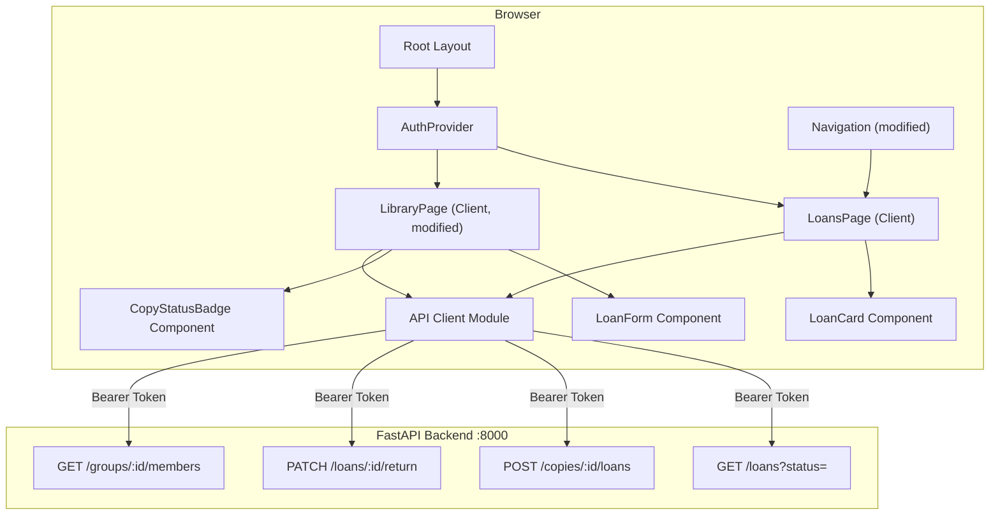

# Design Document: Loans Frontend (M7 UI)

## Overview

This design adds a loans management interface to the EntreLíneas Next.js frontend. It introduces a new `/loans` page for viewing active and returned loans, modifies the existing `/library` page to show loan status and a "Prestar" action on eligible copies, and adds a navigation link.

The design follows the established frontend architecture: client components with `"use client"`, `ProtectedRoute` wrapper, centralized API client (`apiGet`, `apiPost`, `apiPatch`), toast notifications, skeleton loading states, and all text in Spanish.

Key design decisions:
- **New `GET /loans` endpoint assumed**: The backend currently only has POST and PATCH. This design assumes a `GET /loans?status={active|returned}` endpoint will be added to list the authenticated user's loans. If unavailable at implementation time, a workaround (fetching loans per copy) will be used.
- **Loan data includes book title and borrower name**: The API response must include denormalized fields (`book_title`, `borrower_name`) to avoid N+1 lookups on the frontend. This will be coordinated with backend.
- **Privacy enforcement on frontend**: Digital copies are filtered out of loan-eligible UI. The "Prestar" button never renders for digital copies or already-loaned copies. No `file_ref` or `filename` fields are ever rendered in loan contexts.
- **Tab-based navigation on Loans page**: Active and returned loans are shown via two tabs ("Activos" / "Historial").

## Architecture



### Route Addition

| Route | Component | Auth Required | Description |
|-------|-----------|---------------|-------------|
| `/loans` | LoansPage | Yes | Active + returned loans with tabs |

### File Organization (new/modified files)

```
src/
├── app/
│   └── loans/page.tsx              # NEW — Loans page with tabs
├── components/
│   ├── navigation.tsx              # MODIFIED — Add "Préstamos" link
│   ├── loan-card.tsx               # NEW — Individual loan display
│   ├── loan-form.tsx               # NEW — Create loan modal/inline form
│   └── copy-status-badge.tsx       # NEW — Badge for copy loan status
├── app/
│   └── library/page.tsx            # MODIFIED — Add Prestar button + badges
└── types/
    └── index.ts                    # MODIFIED — Add Loan type
```

## Components and Interfaces

### LoanCard (`src/components/loan-card.tsx`)

Displays a single loan's information. Used in both "Activos" and "Historial" tabs.

```typescript
interface LoanCardProps {
  loan: LoanWithDetails;
  variant: "active" | "returned";
  onReturn?: (loanId: string) => Promise<void>;
  isReturning?: boolean;
}
```

**Active variant** shows: book title, borrower name, loan date, estimated return date (if set), and "Marcar devuelto" button.

**Returned variant** shows: book title, borrower name, loan date, returned date. No action button.

### LoanForm (`src/components/loan-form.tsx`)

Inline form for creating a loan on a specific copy.

```typescript
interface LoanFormProps {
  copyId: string;
  groupMembers: GroupMember[];
  onSuccess: () => void;
  onCancel: () => void;
}

interface GroupMember {
  user_id: string;
  name: string;
}
```

**Fields:**
- Borrower selector (dropdown of group members) — required
- Estimated return date (date input) — optional

**Behavior:**
- Calls `POST /copies/{copyId}/loans` on submit
- Disables submit button during request
- Shows toast on success/error
- Calls `onSuccess()` to update parent state on completion

### CopyStatusBadge (`src/components/copy-status-badge.tsx`)

```typescript
interface CopyStatusBadgeProps {
  status: "available" | "on_loan";
  borrowerName?: string;
  loanDate?: string;
}
```

**Renders:**
- `available` → Green badge "Disponible"
- `on_loan` → Orange badge "Prestado a {borrowerName}" with loan date

### Navigation Modification

Add to `desktopNavItems`:
```typescript
{ label: "Préstamos", href: "/loans", icon: "🔄" }
```

Add to `mobileNavItems`:
```typescript
{ label: "Préstamos", href: "/loans", icon: "🔄" }
```

### LoansPage (`src/app/loans/page.tsx`)

```typescript
// State
const [activeTab, setActiveTab] = useState<"active" | "returned">("active");
const [loans, setLoans] = useState<LoanWithDetails[]>([]);
const [loading, setLoading] = useState(true);
```

**Tab behavior:**
- "Activos" tab fetches `GET /loans?status=active`
- "Historial" tab fetches `GET /loans?status=returned`
- Tab switch triggers new fetch

### Library Page Modifications

The existing library page gains:
1. **Copy loan status fetching** — When displaying book copies, also fetch loan status per copy
2. **CopyStatusBadge** — Displayed next to each physical copy
3. **"Prestar" button** — Only on physical copies with `status === "available"`
4. **LoanForm** — Appears inline when "Prestar" is clicked

### API Endpoints Used

| Endpoint | Method | Purpose |
|----------|--------|---------|
| `/loans?status=active` | GET | List active loans for authenticated user |
| `/loans?status=returned` | GET | List returned loans for authenticated user |
| `/copies/{id}/loans` | POST | Create a new loan |
| `/loans/{id}/return` | PATCH | Mark loan as returned |
| `/groups/{id}/members` | GET | Get group members for borrower selection |

## Data Models

### New Types (to add to `src/types/index.ts`)

```typescript
// === Loans ===
export interface Loan {
  id: string;
  copy_id: string;
  borrower_user_id: string;
  loan_date: string;
  estimated_return_date: string | null;
  returned_date: string | null;
  status: "active" | "returned";
}

export interface LoanWithDetails extends Loan {
  book_title: string;
  borrower_name: string;
}

export interface CreateLoanRequest {
  borrower_user_id: string;
  estimated_return_date?: string;
}
```

### Copy Type Extension

The existing `Copy` type already includes `format: "physical" | "digital"`. For loan status display, copies returned from the API should include loan information:

```typescript
export interface CopyWithLoanStatus extends Copy {
  loan_status: "available" | "on_loan";
  active_loan?: {
    borrower_name: string;
    loan_date: string;
  } | null;
}
```

## Correctness Properties

*A property is a characteristic or behavior that should hold true across all valid executions of a system — essentially, a formal statement about what the system should do. Properties serve as the bridge between human-readable specifications and machine-verifiable correctness guarantees.*

### Property 1: "Prestar" button visibility

*For any* copy object rendered in the library page, the "Prestar" button SHALL appear if and only if the copy has `format === "physical"` AND `loan_status === "available"`. For any copy where `format === "digital"` OR `loan_status === "on_loan"`, the "Prestar" button SHALL NOT appear.

**Validates: Requirements 3.1, 5.3, 6.2**

### Property 2: Loan card renders all required fields for its status

*For any* loan object, when rendered as a LoanCard:
- If `status === "active"`: the rendered output SHALL contain the book title, borrower name, loan date, and estimated return date (when present).
- If `status === "returned"`: the rendered output SHALL contain the book title, borrower name, loan date, and returned date.

**Validates: Requirements 1.3, 2.2**

### Property 3: No loan display ever contains file references

*For any* loan response object (regardless of what extra fields the API might return), the rendered loan UI (LoanCard, Loans page) SHALL NOT contain the values of `file_ref`, `filename`, or any file path string from the loan data.

**Validates: Requirements 6.1, 6.4**

## Error Handling

### Loan-Specific Error Mapping

```typescript
const LOAN_ERROR_MESSAGES: Record<string, string> = {
  copy_already_on_loan: "Esta copia ya está prestada.",
  invalid_copy_type: "Solo se pueden prestar copias físicas.",
  "Loan not found": "Préstamo no encontrado.",
  "Copy not found": "Copia no encontrada.",
};
```

### Error Scenarios

| Action | HTTP Status | User Feedback |
|--------|-------------|---------------|
| Create loan | 201 | Toast: "Préstamo registrado" |
| Create loan | 409 | Toast: "Esta copia ya está prestada." |
| Create loan | 422 | Toast: "Solo se pueden prestar copias físicas." |
| Return loan | 200 | Toast: "Préstamo devuelto" |
| Return loan | 404 | Toast: "Préstamo no encontrado." |
| List loans | 5xx | Toast: "Error de servidor. Intenta de nuevo más tarde." |
| Network error | — | Toast: "No se pudo conectar al servidor." |

### Loading States

- **Loans page initial load**: Skeleton placeholders (card variant) until loans arrive
- **Tab switch**: Skeleton placeholders during new fetch
- **"Prestar" form submit**: Button disabled + "Registrando..." text
- **"Marcar devuelto" action**: Button disabled + "Devolviendo..." text

### Empty States

- No active loans: "No tienes préstamos activos."
- No returned loans: "No tienes préstamos devueltos."

## Testing Strategy

### Testing Framework

- **Vitest** for unit and property-based tests
- **React Testing Library** for component rendering
- **fast-check** for property-based testing
- **MSW** for API mocking

### Property-Based Tests (fast-check)

Each correctness property is implemented as a property-based test with minimum 100 iterations:

| Property | Target Module | Tag |
|----------|---------------|-----|
| Property 1 | `src/app/library/page.tsx` render logic | `Feature: loans-frontend, Property 1: Prestar button visibility` |
| Property 2 | `src/components/loan-card.tsx` | `Feature: loans-frontend, Property 2: Loan card renders all required fields` |
| Property 3 | `src/components/loan-card.tsx` | `Feature: loans-frontend, Property 3: No file references in loan display` |

**Configuration:**
- Library: `fast-check` (already in devDependencies from frontend-catchup)
- Minimum runs: 100 per property
- Each test tagged with comment referencing the design property

### Unit Tests (Example-Based)

- Navigation renders "Préstamos" link in both desktop and mobile
- Loans page renders tabs and switches between them
- Loans page shows empty state messages
- LoanForm submits correct payload to API
- LoanForm handles 409/422 errors with correct toasts
- Return button calls correct endpoint
- Return success moves loan from active to history
- Loading skeletons display during data fetch
- ProtectedRoute redirects unauthenticated users

### Edge Case Tests

- Copy with `format: "digital"` never shows "Prestar" button
- Loan with `estimated_return_date: null` renders correctly without crashing
- Loan response with unexpected `file_ref` field is not rendered
- Empty group members list disables form submission
- Concurrent return action (double-click) only fires one request

### Test File Organization

```
src/
├── __tests__/
│   ├── components/
│   │   ├── loan-card.test.tsx         # Property 2 + 3 (PBT) + unit tests
│   │   ├── loan-form.test.tsx         # Unit tests
│   │   └── copy-status-badge.test.tsx # Unit tests
│   ├── app/
│   │   ├── loans.test.tsx             # Unit tests (page behavior)
│   │   └── library-loans.test.tsx     # Property 1 (PBT) + unit tests
│   └── setup.ts                       # MSW handlers for loan endpoints
```
