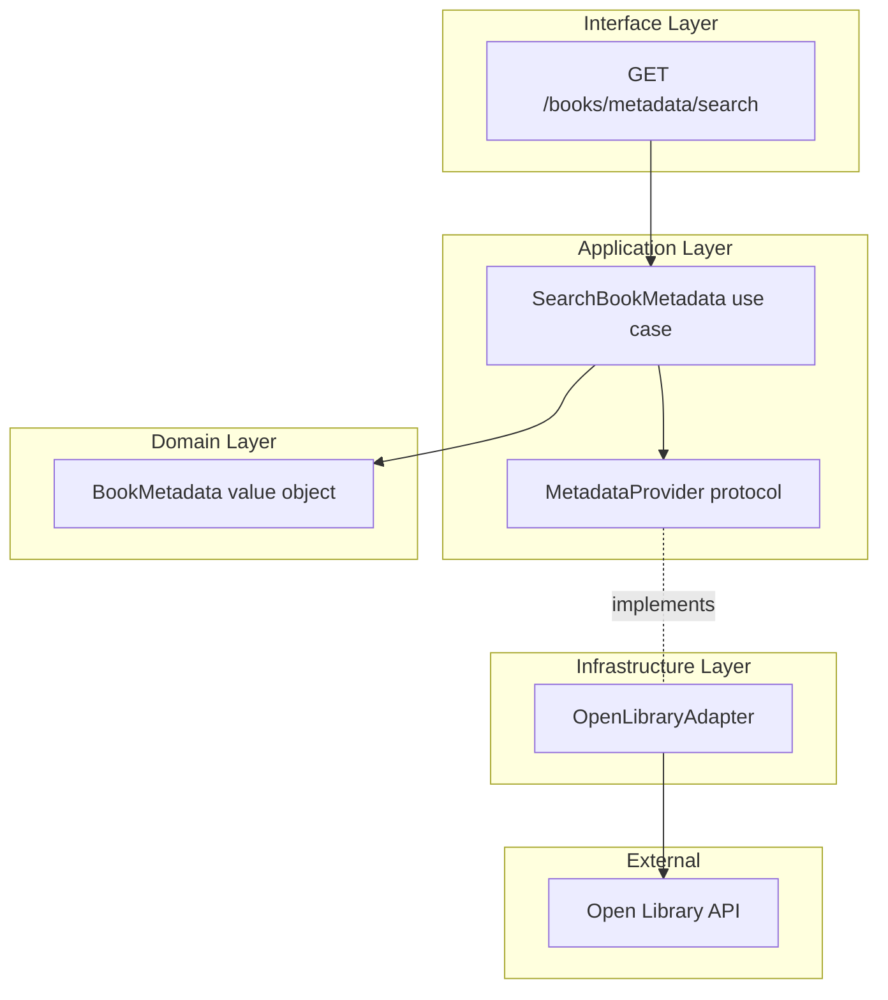

# Design Document: Metadata Import

## Overview

The Metadata Import feature allows users to autocomplete book metadata from external sources when adding a book to their library. It provides a search-by-ISBN and search-by-text flow that queries the Open Library API and returns structured `BookMetadata` results the frontend uses to prefill the book creation form.

This feature is a read-only convenience layer — it never persists external API data, never transmits user identifiers, and never blocks manual book creation. It lives within the Library bounded context as a use case (ADR-0011), with the external API adapter behind a `MetadataProvider` protocol (ADR-0017).

### Key Design Decisions

1. **Value object, not entity**: `BookMetadata` is a transient value object with optional fields — it has no identity or persistence.
2. **Two search modes**: ISBN lookup returns 0–1 results; text search returns 0–10 results. Both go through the same protocol.
3. **Validation at the edge**: ISBN format validation happens in the use case before calling the provider, avoiding unnecessary network calls.
4. **Timeout-first resilience**: The adapter enforces a strict 5-second timeout. On failure, a structured error propagates to the caller without crashing.
5. **No caching in MVP**: Responses are not cached. Future optimization can add TTL-based caching at the adapter level without changing the protocol.

## Architecture



**Data flow:**
1. Frontend sends `GET /books/metadata/search?query=...&type=isbn|text`
2. Router delegates to `SearchBookMetadata` use case
3. Use case validates input, then calls `MetadataProvider.search_by_isbn()` or `MetadataProvider.search_by_text()`
4. `OpenLibraryAdapter` makes HTTP request to Open Library, maps response to `BookMetadata` objects
5. Use case returns `list[BookMetadata]` to the router
6. Router serializes to JSON and responds to the frontend

## Components and Interfaces

### Domain Layer: `BookMetadata` value object

Located in `backend/app/library/domain/entities.py`.

```python
@dataclass(frozen=True)
class BookMetadata:
    """Transient value object for externally sourced book metadata.

    All fields except title are optional — external sources may not
    have complete information for every edition.
    """

    title: str
    author: str | None = None
    genres: list[str] = field(default_factory=list)
    description: str | None = None
    pages: int | None = None
    isbn: str | None = None
```

Design rationale:
- `frozen=True` because it's a value object — immutable after creation.
- `title` is required (a result without a title is useless for autocomplete).
- `author` is optional because some Open Library editions lack author info at the edition level.
- All other fields are optional to handle partial data from external sources gracefully.

### Application Layer: `MetadataProvider` protocol

Located in `backend/app/library/application/protocols.py`.

```python
class MetadataProvider(Protocol):
    """Abstraction for external book metadata sources.

    Reference: ADR-0017 (cloud agnostic — all dependencies behind abstractions)
    """

    def search_by_isbn(self, isbn: str) -> BookMetadata | None:
        """Search for a single book by ISBN.

        Args:
            isbn: A normalized ISBN-10 or ISBN-13 (digits only, no hyphens).

        Returns:
            BookMetadata if found, None if no match exists.

        Raises:
            MetadataProviderError: On network failure or timeout.
        """
        ...

    def search_by_text(self, query: str, limit: int = 10) -> list[BookMetadata]:
        """Search for books by title/author free text.

        Args:
            query: Free-text search string (title, author, or combination).
            limit: Maximum results to return (default 10, max 10).

        Returns:
            List of BookMetadata results, possibly empty.

        Raises:
            MetadataProviderError: On network failure or timeout.
        """
        ...
```

### Application Layer: `MetadataProviderError`

Located in `backend/app/library/application/protocols.py`.

```python
class MetadataProviderError(Exception):
    """Raised when an external metadata provider is unreachable or returns an error."""

    def __init__(self, message: str = "External metadata service unavailable"):
        super().__init__(message)
        self.message = message
```

### Application Layer: `SearchBookMetadata` use case

Located in `backend/app/library/application/search_book_metadata.py`.

```python
@dataclass
class SearchBookMetadataRequest:
    query: str
    search_type: str = "text"  # "isbn" or "text"


class SearchBookMetadata:
    def __init__(self, metadata_provider: MetadataProvider):
        self._provider = metadata_provider

    def execute(self, request: SearchBookMetadataRequest) -> list[BookMetadata]:
        if request.search_type == "isbn":
            normalized = self._normalize_isbn(request.query)
            self._validate_isbn(normalized)
            result = self._provider.search_by_isbn(normalized)
            return [result] if result else []
        else:
            query = request.query.strip()
            if not query:
                return []
            return self._provider.search_by_text(query, limit=10)

    @staticmethod
    def _normalize_isbn(raw: str) -> str:
        return raw.replace("-", "").replace(" ", "").strip()

    @staticmethod
    def _validate_isbn(isbn: str) -> None:
        if not isbn.isdigit() or len(isbn) not in (10, 13):
            raise InvalidIsbnError(isbn)


class InvalidIsbnError(ValueError):
    def __init__(self, isbn: str):
        super().__init__(f"Invalid ISBN format: '{isbn}'. Must be 10 or 13 digits.")
        self.isbn = isbn
```

Design rationale:
- ISBN normalization (strip hyphens/spaces) happens before validation — this matches real-world user input patterns.
- Validation rejects ISBNs that aren't exactly 10 or 13 digits after normalization. This prevents wasted API calls.
- Text search trims whitespace and short-circuits on empty input.
- The use case does **not** catch `MetadataProviderError` — it propagates to the interface layer for proper HTTP error mapping.

### Infrastructure Layer: `OpenLibraryAdapter`

Located in `backend/app/library/infrastructure/open_library_adapter.py`.

```python
import httpx

class OpenLibraryAdapter:
    """MetadataProvider implementation using the Open Library API.

    Endpoints used:
    - ISBN lookup: https://openlibrary.org/isbn/{isbn}.json
    - Text search: https://openlibrary.org/search.json?q={query}&limit={limit}&fields=...

    Reference: ADR-0017 (cloud agnostic — infrastructure implements application protocols)
    """

    BASE_URL = "https://openlibrary.org"
    TIMEOUT_SECONDS = 5.0
    SEARCH_FIELDS = "title,author_name,isbn,number_of_pages_median,subject"
    USER_AGENT = "EntreLineas/1.0 (library-platform)"

    def __init__(self, timeout: float = TIMEOUT_SECONDS):
        self._timeout = timeout

    def search_by_isbn(self, isbn: str) -> BookMetadata | None:
        """Fetch a single edition by ISBN from Open Library."""
        ...

    def search_by_text(self, query: str, limit: int = 10) -> list[BookMetadata]:
        """Search Open Library by free text (title/author)."""
        ...
```

**Open Library API response mapping:**

| Open Library field (ISBN endpoint) | BookMetadata field |
|---|---|
| `title` | `title` |
| `authors[0].key` → fetch author name | `author` |
| `subjects` (first 5) | `genres` |
| `description` (or `notes`) | `description` |
| `number_of_pages` | `pages` |
| `isbn_13[0]` or `isbn_10[0]` | `isbn` |

| Open Library field (Search endpoint) | BookMetadata field |
|---|---|
| `title` | `title` |
| `author_name[0]` | `author` |
| `subject` (first 5) | `genres` |
| (not available in search) | `description` = None |
| `number_of_pages_median` | `pages` |
| `isbn[0]` (first ISBN from list) | `isbn` |

**Implementation notes:**
- The ISBN endpoint returns author as a key reference (`/authors/OL...`). The adapter resolves author names by fetching `{BASE_URL}{author_key}.json` (single additional request) or falls back to `None` if it fails.
- The search endpoint returns `author_name` directly — no secondary lookup needed.
- `description` is only available from the ISBN endpoint (edition-level data). Search results return `None`.
- The adapter uses `httpx` with a configured timeout for all requests.
- A custom `User-Agent` header identifies the application per Open Library's usage guidelines.

### Interface Layer: Endpoint and Schemas

Located in `backend/app/library/interface/books_router.py` (new endpoint) and `backend/app/library/interface/schemas.py` (new schema).

**Pydantic schema:**

```python
class BookMetadataResponse(BaseModel):
    """A single metadata search result."""
    title: str
    author: str | None = None
    genres: list[str] = Field(default_factory=list)
    description: str | None = None
    pages: int | None = None
    isbn: str | None = None
```

**Endpoint:**

```python
@router.get("/metadata/search", response_model=list[BookMetadataResponse])
def search_book_metadata(
    query: str,
    type: str = "text",  # "isbn" or "text"
    user_id: UUID = Depends(get_current_user_id),
    ...
):
    """Search external sources for book metadata (autocomplete).

    Privacy: only transmits the query string to external APIs.
    No user identifiers are sent. No responses are persisted.
    """
```

Route placement: This endpoint MUST be declared before the `/{book_id}` route in the router to avoid path parameter capture (same pattern as `/statuses`).

## Data Models

### BookMetadata (Value Object)

| Field | Type | Required | Source |
|---|---|---|---|
| `title` | `str` | Yes | Open Library `title` |
| `author` | `str \| None` | No | Open Library `author_name` or resolved author key |
| `genres` | `list[str]` | No (empty list) | Open Library `subjects` (first 5) |
| `description` | `str \| None` | No | Open Library `description` (ISBN only) |
| `pages` | `int \| None` | No | Open Library `number_of_pages` or `number_of_pages_median` |
| `isbn` | `str \| None` | No | Open Library `isbn_13[0]` or `isbn_10[0]` |

### No Database Changes

This feature is purely transient — no tables, no migrations, no persistence. `BookMetadata` exists only in memory during the request lifecycle.

## Correctness Properties

*A property is a characteristic or behavior that should hold true across all valid executions of a system — essentially, a formal statement about what the system should do. Properties serve as the bridge between human-readable specifications and machine-verifiable correctness guarantees.*

### Property 1: ISBN normalization accepts valid formats

*For any* string composed of exactly 10 or 13 digit characters interspersed with arbitrary hyphens and spaces, normalizing and validating that string SHALL succeed without raising an error.

**Validates: Requirements 1.1, 1.3**

### Property 2: Malformed ISBN rejection

*For any* string where, after removing all hyphens and spaces, the remaining characters are not exclusively digits OR the digit count is neither 10 nor 13, the `SearchBookMetadata` use case with `search_type="isbn"` SHALL raise `InvalidIsbnError`.

**Validates: Requirements 1.3**

### Property 3: Text search result size bounded

*For any* non-empty text query and any `MetadataProvider` implementation that returns a list, the result list returned by `SearchBookMetadata` SHALL contain at most 10 items.

**Validates: Requirements 2.1**

### Property 4: All results contain a non-empty title

*For any* successful metadata search (ISBN or text), every `BookMetadata` object in the result list SHALL have a non-empty `title` field, and SHALL include all schema fields (title, author, genres, description, pages, isbn) even when their values are None/empty.

**Validates: Requirements 2.3, 7.5**

### Property 5: Provider error propagation

*For any* `MetadataProviderError` raised by the `MetadataProvider` during search execution, the `SearchBookMetadata` use case SHALL NOT catch or suppress the exception — it SHALL propagate to the caller unchanged.

**Validates: Requirements 4.1**

## Error Handling

| Scenario | Layer | Behavior | HTTP Status |
|---|---|---|---|
| Malformed ISBN (not 10/13 digits) | Application (use case) | Raises `InvalidIsbnError` | 422 Unprocessable Entity |
| Empty text query | Application (use case) | Returns `[]` immediately | 200 OK (empty array) |
| ISBN not found in Open Library | Infrastructure (adapter) | Returns `None` → use case returns `[]` | 200 OK (empty array) |
| Text search yields no results | Infrastructure (adapter) | Returns `[]` | 200 OK (empty array) |
| Network timeout (> 5s) | Infrastructure (adapter) | Raises `MetadataProviderError` | 503 Service Unavailable |
| Connection refused / DNS failure | Infrastructure (adapter) | Raises `MetadataProviderError` | 503 Service Unavailable |
| Open Library returns 5xx | Infrastructure (adapter) | Raises `MetadataProviderError` | 503 Service Unavailable |
| Open Library returns unexpected JSON | Infrastructure (adapter) | Logs warning, returns partial result or `None` | 200 OK (partial/empty) |
| Missing authentication token | Interface (router) | FastAPI dependency rejects request | 401 Unauthorized |
| Invalid `type` parameter | Interface (router) | Defaults to "text" search | 200 OK |

**Error response format** (for 503):

```json
{
  "detail": "external_metadata_service_unavailable"
}
```

**Error response format** (for 422):

```json
{
  "detail": "invalid_isbn_format"
}
```

## Testing Strategy

### Property-Based Tests (Hypothesis)

This feature is well-suited for property-based testing because:
- ISBN validation is a pure function with a clear input/output contract
- The normalization logic handles a large input space (arbitrary strings with hyphens, spaces, digits)
- The `BookMetadata` construction from API responses is a data transformation

**Library:** [Hypothesis](https://hypothesis.readthedocs.io/) (already standard for Python PBT)
**Configuration:** Minimum 100 iterations per property test

Each correctness property maps to a single property-based test:

| Property | Test | Tag |
|---|---|---|
| 1 | Generate strings with 10/13 digits + random hyphens/spaces → normalization + validation succeeds | `Feature: metadata-import, Property 1: ISBN normalization accepts valid formats` |
| 2 | Generate strings that DON'T have 10/13 digits after cleanup → validation raises `InvalidIsbnError` | `Feature: metadata-import, Property 2: Malformed ISBN rejection` |
| 3 | Generate random non-empty text queries + mock provider → verify result list size ≤ 10 | `Feature: metadata-import, Property 3: Text search result size bounded` |
| 4 | Generate random BookMetadata lists → verify all have non-empty title and all schema fields present | `Feature: metadata-import, Property 4: All results contain a non-empty title` |
| 5 | Generate random MetadataProviderError → verify it propagates through use case unchanged | `Feature: metadata-import, Property 5: Provider error propagation` |

### Unit Tests (Pytest)

- `SearchBookMetadata` use case: happy paths with mocked provider
- `OpenLibraryAdapter` response mapping: specific JSON fixtures from Open Library
- Edge cases: ISBN with only hyphens, unicode in query, empty author list, missing fields in API response

### Integration Tests (Pytest + FastAPI TestClient)

- `GET /books/metadata/search?query=9780143120537&type=isbn` → 200 with mocked adapter
- `GET /books/metadata/search?query=abc&type=isbn` → 422 validation error
- `GET /books/metadata/search?query=Don+Quixote&type=text` → 200 with results
- `GET /books/metadata/search` without auth → 401
- Provider unavailable → 503 with structured error

### What's NOT property-tested

- The HTTP adapter's actual network calls (integration test with 1-2 examples)
- The endpoint's authentication logic (example-based integration test)
- Frontend autocomplete behavior (UI test, outside backend scope)
