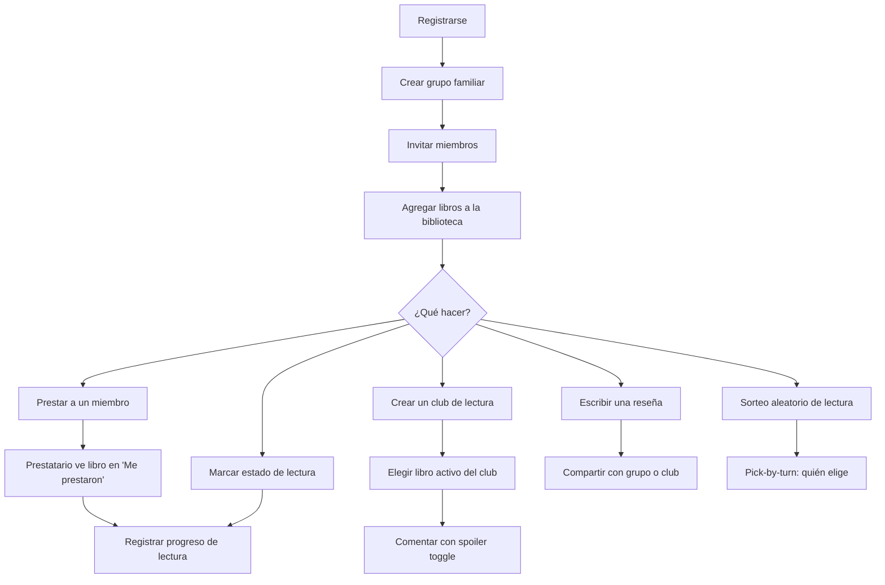
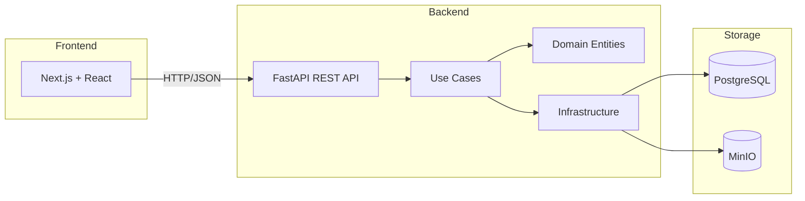

# EntreLíneas

A web platform for managing personal libraries (physical and digital) and fostering shared reading among families and small book clubs.

> *"Las historias nos unen"* — Stories bring people together.

## Progress

| Milestone | Status |
|-----------|--------|
| M-1 Architecture Validation | ✅ Complete |
| M0 Privacy Foundation | ✅ Complete |
| M1 Authentication (JWT) | ✅ Complete |
| M2 Users & Groups | ✅ Complete |
| M3 Library (Books, Copies, Search) | ✅ Complete |
| M4 Reading Selection (Draw + Turn) | ✅ Complete |
| M5 Clubs & Reading Turns | ✅ Complete |
| M6 Reviews | ✅ Complete |
| M6.5 Frontend Catchup | ✅ Complete |
| M7 Loans | ✅ Complete |
| M8 Privacy Panel | ✅ Complete |
| M9 Release Candidate | ✅ Complete |
| Post-MVP: Integrated Reader | ✅ Complete |
| Post-MVP: Metadata Import | ✅ Complete |

**12/12 milestones complete + post-MVP reader & metadata import** · Architecture frozen · 17 ADRs · 11 specs · ~524 tests

## User Flow



## Quick Start

### Local Development

```bash
docker compose up -d   # Start PostgreSQL + MinIO
cd backend
pip install -e ".[dev]"
alembic upgrade head   # Run migrations (12 migrations)
uvicorn app.main:app --host 0.0.0.0 --port 8000 --reload

cd frontend
npm install
npm run dev            # Start frontend (port 3000)
```

Shortcuts:
```bash
make up        # Start infrastructure
make test      # Run all test suites
make lint      # Run linters (Ruff + ESLint)
make down      # Stop all services
```

### Production Deployment

```bash
cp backend/.env.example .env  # Set production secrets
docker compose -f docker-compose.prod.yml up --build -d
docker compose -f docker-compose.prod.yml exec backend alembic upgrade head
```

See [docs/deployment.md](docs/deployment.md) for full guide with security checklist.

## Features

### Library Management
- **Books & Copies:** Separate catalog from ownership. A book can have multiple physical/digital copies per user
- **Shelf View:** Visual bookshelf with colored spines grouped by reading status, drag-to-scroll
- **List View:** Searchable list with mini progress bars for books in progress
- **Unified Book Modal:** Click any book to edit, manage copies, lend, change status, track progress
- **Reading Progress:** Track current page with visual progress bar ("Página 145 / 320")
- **Metadata Import:** Search Open Library by ISBN or title/author for autocomplete when adding books. Prefills form fields, fully editable before saving

### Integrated Reader
- **EPUB reader:** epub.js with paginated flow, CFI-based position tracking, chapter navigation
- **PDF reader:** PDF.js with single-page render, page navigation, keyboard shortcuts
- **Auto-save progress:** Debounced (5s), syncs with library preview bar
- **Position restore:** Reopening a book resumes from exact last position
- **Upload:** Drag & drop EPUB/PDF files directly from book detail modal
- **Mobile responsive:** Touch-friendly navigation, full-screen reading mode
- **Security:** File served only to authenticated owner (403 for everyone else)

### Social Reading
- **Family Groups:** Invitation-based membership with multi-group support
- **Book Clubs:** Clubs within family groups, active book coordination, spoiler-safe comments
- **Reading Selection:** Filtered random draw + fair pick-by-turn rotation
- **Reviews:** Private or shared with explicit visibility control (group or club)
- **Shared Reviews Feed:** See reviews others shared with your groups

### Loans
- **Physical lending:** Register loans to group members with estimated return dates
- **Borrower view:** "Me prestaron" shelf with reading progress tracking
- **Multi-group:** Lend to members of any group you belong to
- **History:** Returned books preserved in "Devueltos" shelf with reading progress

### Privacy & Security (Ley 21.719)
- **ARCO rights:** Self-service export, rectify, delete, oppose, view registered oppositions
- **Consent gating:** Registration requires explicit privacy consent
- **Data isolation:** Digital files never shared between accounts (ADR-0001)
- **Configurable retention:** Policies stored in DB, no hardcoded durations
- **Field encryption:** Fernet-based PII encryption infrastructure
- **Audit logging:** High-value operations tracked

### Authentication
- **Custom JWT:** Access token (short-lived) + Refresh token (rotatable, revocable)
- **No third-party auth:** No Supabase Auth, no Cognito, no sessions
- **Token refresh:** Automatic 401 retry with token rotation

## API Overview

| Module | Endpoints | Key Routes |
|--------|-----------|------------|
| **Auth** | 4 | `POST /auth/register`, `/login`, `/refresh`, `/logout` |
| **Groups** | 5 | `GET/POST /groups`, `/invitations`, `/{id}/members`, `/accept` |
| **Books** | 7 | `GET/POST /books`, `/{id}`, `/statuses`, `/{id}/status`, `/metadata/search` |
| **Copies** | 6 | `POST /copies/physical`, `/digital`, `GET /copies/{id}`, `/{id}/file`, `/{id}/progress`, `PUT /{id}/progress` |
| **Clubs** | 8 | `GET/POST /clubs`, `/{id}`, `/members`, `/comments`, `/active-book`, `/available-books` |
| **Reviews** | 5 | `GET/POST /reviews`, `/shared`, `PATCH/DELETE /{id}`, `GET /books/{id}/reviews` |
| **Loans** | 4 | `POST /copies/{id}/loans`, `GET /loans`, `/borrowed`, `PATCH /{id}/return` |
| **Selection** | 3 | `POST /groups/{id}/draws`, `GET /draws`, `/next-picker` |
| **Privacy** | 5 | `GET /users/me/export`, `PATCH /users/me`, `DELETE /users/me`, `POST/GET /users/me/oppose` |
| **Admin** | 1 | `POST /admin/retention/run` |

Full API docs available at `http://localhost:8000/docs` (Swagger UI).

## Architecture

```
Clean Architecture + DDD (lightweight)
├── Interface (FastAPI REST / Next.js)
├── Application (use cases + protocols)
├── Domain (entities, no framework imports)
└── Infrastructure (PostgreSQL, MinIO, JWT)
```



Key decisions: [17 ADRs](docs/adr/) · Cloud agnostic · Ley 21.719 compliance from day one

## Project Documentation

- **[docs/PROJECT_CONTEXT.md](docs/PROJECT_CONTEXT.md)** — complete project overview (start here)
- **[docs/deployment.md](docs/deployment.md)** — production deployment guide + security checklist
- **[docs/architecture/](docs/architecture/)** — architecture, tech stack, API, database
- **[.kiro/specs/](.kiro/specs/)** — implementation specifications (source of truth)
- **[docs/adr/](docs/adr/)** — architecture decision records
- **[IMPLEMENTATION_STATUS.md](IMPLEMENTATION_STATUS.md)** — detailed progress tracking
- **[CHANGELOG.md](CHANGELOG.md)** — what was delivered per milestone

## Structure

```
backend/           FastAPI + SQLAlchemy + Alembic
  app/
    identity/      Authentication, users, groups
    library/       Books, copies, reading status, file storage, integrated reader
    community/     Clubs, reading turns, comments
    reviews/       Book reviews with visibility control
    reading_selection/  Draw, pick-by-turn
    circulation/   Loans (physical copies only)
    auth/          JWT utilities
    security/      Field encryption
frontend/          Next.js + React + TypeScript + Tailwind
  src/
    app/           Pages (library, loans, reviews, groups, clubs, settings, reader…)
    components/    Shared UI (BookSpine, BookShelf, BookDetailModal, PdfReader, EpubReader, Navigation…)
    context/       Auth + Toast providers
    lib/           API client, token storage, useReadingProgress hook, settings-validation, export-download
    types/         TypeScript contracts
docs/              Project documentation + deployment guide
.kiro/             Specifications + steering rules
```

## Development

Requires: Docker, Docker Compose, Python 3.12+, Node.js 20+.

See `docs/ai/DEVELOPMENT_WORKFLOW.md` for contribution workflow.

## Tech Stack

- **Backend:** FastAPI, SQLAlchemy, Alembic, PyJWT, bcrypt
- **Frontend:** Next.js 16, React 19, TypeScript, Tailwind, Lucide icons
- **Database:** PostgreSQL 16
- **Storage:** MinIO (S3-compatible, per-user isolation)
- **CI:** GitHub Actions (Ruff + Pytest + ESLint + Build)
- **Containers:** Docker Compose (dev + production)

## Design System

"Sala de lectura" — warm library aesthetic:

| Token | Color | Usage |
|-------|-------|-------|
| Walnut | `#2C1F14` | Primary text, headings, buttons |
| Brass | `#B8892A` | Accents, active states, CTAs |
| Parchment | `#F5EDD8` | Page background |
| Cream | `#FBF6EC` | Cards, panels |
| Teak | `#8B5E3C` | Shelf wood, secondary accents |
| Ink | `#1E140A` | Body text |
| Reading Green | `#2E5C3E` | "Currently reading" status |

Typography: **Playfair Display** (headings) + **Inter** (body).
